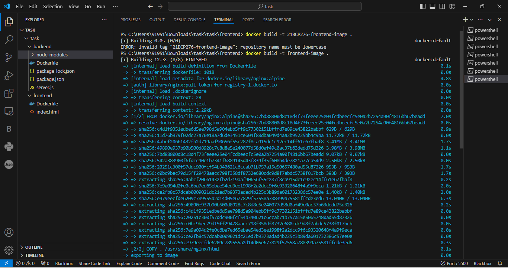

<!-- **bold**, _italic_, ~~strikethrough~~ or `keyword`. -->
<!-- [Link to another page](./another-page.html). -->

# **3-Tier Architecture Application Developing using Docker**

Follow my GitHub Account: [Jahnvi Gupta](https://github.com/jahnvi047)

## Prerequisites

---

- System: windows 11 (Jammy Jellyfish)
- Install "Docker" on your machine. For installing Docker, visit: [Official Documentation](https://docs.docker.com/engine/install/ubuntu/)

## Overview:

---

My project implements a 3-tier architecture using Docker containers. 

The architecture consists of:

- Frontend Form : Which uses Html Form and CSS form will Post the Data.
- API : Backend : Used Express.js, And MySQL Server For Data Fetch And Post Using Rest API
- MySQL: Houses the database.

This app shows a simple user profile app set up using

1. index.html with pure js and css styles
2. nodejs backend with express module
3. mysql for data storage (database)

<div style="text-align: justify">

This modular design provides a strong basis for the deployment of scalable and effective applications by facilitating independent scaling, guaranteeing consistent deployment across environments, and streamlining maintenance tasks.

</div>

## Step 1. Frontend Set-Up

## Step 1.1 open integrated terminal for frontend code.


## Step 1.2 Build the Frontend Docker Image 

```js
// Docker Command
docker build -t <image_of_frontend> .
```
-'docker build': This command builds an image from a Dockerfile.
-'-t' my-frontend-image: This flag specifies the name and optionally a tag to apply to the image being built. In this case, the image will be tagged as my-frontend-image.
-'.': This specifies the build context, which is the path to the directory containing the Dockerfile. Here,'.' denotes the current directory.
-'<image_of_frontned>' is the name of image we have build for frontend.



## Step 1.3 Run the Frontend Container

```js
// Docker Command
docker run --network cloud -p 80:80 -d <image_of_frontend>
```
-'docker run'is used to create and start a new Docker container based on a specified image.
-'--network cloud' specifies the network the container should be attached to. In this case, the container will be connected to the network named cloud.
-'-p 80:80' publishes a container's port(s) to the host. In this case, it maps port 80 on the host to port 80 on the container. This allows traffic coming to port 80 on the host to be forwarded to port 80 on the container.
-'-d' runs the container in detached mode, meaning it runs in the background and doesn't occupy the current terminal session. The container's output is not displayed in the terminal.
-'<image_of_frontned>' is the container for image of frontend.


## Step 2. Database Set-Up.

## Step 2.1 Create a docker network for container isolation.

```js
// Docker Command
docker network create <network-name>
```


## Step 2.2 Check if the network is created correctly.

```js
// Docker Command
docker network ls
```


## Step 2.3 Pull mysql database with appropriate environment variables.

```js
// Docker Command
docker run --network <network_name> -e MYSQL_ROOT_PASSWORD=<password_you_want> -e MYSQL_DATABASE=<database_name> -d mysql:latest
```

- --network <network_name>: Specifies the Docker network the container will be connected to.
-e MYSQL_ROOT_PASSWORD=<password_you_want>: Sets the root password for the MySQL server.
-e MYSQL_DATABASE=<database_name>: Specifies the name of the database to be created.
-d: Runs the container in detached mode (background).
-mysql:latest: Specifies the MySQL image to be used. The latest tag is used by default if no tag is provided.


## Step 2.4 Access the MySQL container shell using mysql container ID.

```js
// Docker Command
Docker ps
docker exec -it <container_id_or_name> mysql -u root -p
```

-To check the running containers, you can use the docker ps command.
-To execute a command inside a Docker container, such as accessing MySQL, you can use the docker exec -it <container_id_or_name> mysql -u root -p command. This command will log you into the MySQL shell inside the specified container.
-The -e flag in Docker is used for setting environment variables.
-'-it': Ensures interactive and pseudo-TTY allocation for interactive command-line access.
-'-u' root: Specifies the username to use when logging in (in this case, MySQL root user).
-'-p': Prompts for a password when logging in.


## Step 2.5 Change databse to <database_name> in mysql and create table in it.

```js
// Docker Command
use <databse_name>;
CREATE TABLE Persons (
    id INT AUTO_INCREMENT PRIMARY KEY,
    name VARCHAR(255) NOT NULL,
    email VARCHAR(255) NOT NULL,
    message TEXT
);
```


## Step 2.6 inspect the Docker container using <container_id> 

```js
// Docker Command
docker inspect <id>
```

-'docker inspect <id>' is used to retrieve detailed information about a Docker container, image, network, or volume specified by its ID.
-'docker inspect' is the Docker CLI command used to retrieve detailed information.
-'<id>' is the identifier of the Docker entity you want to inspect. This could be the ID of a container, image, network, or volume.
-Save 'IP address' given after doing inspect of database container.


## Step 3. Backend Set-Up

## Step 3.1 open integrated terminal for frontend code.


## Step 3.2 Build the backend Docker Image 

```js
// Docker Command
docker build -t <image_of_backend> .
```
-'docker build': This command builds an image from a Dockerfile.
-'-t' my-backend-image: This flag specifies the name and optionally a tag to apply to the image being built. In this case, the image will be tagged as my-backend-image.
-'.': This specifies the build context, which is the path to the directory containing the Dockerfile. Here, '.' denotes the current directory.
-'<image_of_backend>' is the name of image we have build for backend.


## Step 3.3 Run the Backend Container

```js
// Docker Command
docker run --network <network_name> -p 5000:5000 -d <image_of_backend>
```
-'docker run'is used to create and start a new Docker container based on a specified image.
-'--network <network_name>' specifies the network the container should be attached to. In this case, the container will be connected to the network named cloud.
-'-p 5000:5000' publishes a container's port(s) to the host. In this case, it maps port 5000 on the host to port 5000 on the container. This allows traffic coming to port 5000 on the host to be forwarded to port 5000 on the container.
-'-d' runs the container in detached mode, meaning it runs in the background and doesn't occupy the current terminal session. The container's output is not displayed in the terminal.
-'<image_of_backned>' is the container for image of backend.


## Step 4. Go to Docker Desktop and click on the localhost link of <image_of_frontend>.


## Step 5. Open your web browser and navigate to http://localhost to access the frontend. You can submit the form, and the data will be stored in the MySQL database via the backend.


<!--  -->
<!--  -->

---

<br/>

### **Key Features and Benefits:**

<div style="text-align: justify">

Modularity: Each tier of our architecture is encapsulated within its own Docker container, allowing for independent scaling and management.

</div>

<div style="text-align: justify">

Scalability: With Docker's orchestration tools like Docker Swarm or Kubernetes, scaling our application horizontally becomes seamless and efficient.

</div>

<div style="text-align: justify">

Portability: Docker containers are highly portable, enabling consistent deployment across different environments, from development to production.

</div>

<div style="text-align: justify">

Ease of Management: Docker's containerization simplifies deployment, configuration, and maintenance tasks, reducing overhead and enhancing operational efficiency.

</div>

<div style="text-align: justify">

Flexibility: By decoupling the application logic, database, and user interface into separate tiers, our architecture offers flexibility for future enhancements and modifications.

</div>

<!--  -->
<br/>

### **Conclusion**:

<div style="text-align: justify">

By adopting a 3-tier architecture with Docker, we've created a scalable and resilient foundation for deploying modern applications. Whether you're building a small-scale prototype or a large-scale production system, leveraging containerization can streamline your development and deployment workflows, empowering you to focus on delivering value to your users.

</div>

<br/>

---

### Name: Jahnvi Gupta (21BCP276)

_Written on April 23, 2024_
